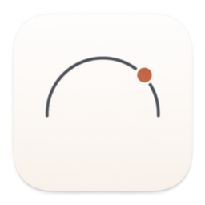

# TokenDash

A quiet macOS menu-bar dashboard for tracking your AI API usage and spend
across multiple providers — so you stop being surprised by end-of-month
bills and runaway scripts.

Built as a native Swift/AppKit app with a WebKit-rendered React/Big Sur-style
UI inside the popover. Zero npm, zero build step for the web side — Babel
runs in-browser.



## What it tracks

| Provider      | Signal                                                | Source                                       |
| ------------- | ----------------------------------------------------- | -------------------------------------------- |
| Claude Code   | tokens today · per-model mix · per-project breakdown · prompt cache hit rate · top sessions | `~/.claude/projects/**/*.jsonl` (local)     |
| Codex         | tokens today · per-model mix · top sessions           | `~/.codex/sessions/**/*.jsonl` (local)       |
| ElevenLabs    | character quota % · TTS requests today/yesterday · 7-day bar | `/v1/user/subscription` + `/v1/history`  |
| OpenRouter    | credits remaining · total spent · 7-day spend bars · top models | `/v1/credits` + `/v1/activity`       |
| Groq          | key presence (no usage API exists yet)                | —                                            |

All data stays on your Mac. API keys live in the system Keychain. Each
snapshot is persisted to `~/Library/Application Support/TokenDash/usage.sqlite3`
so we can draw sparklines and detect anomalies across days.

## Features

- **Right-click the menu-bar icon** for Refresh Now, Settings, Open in Window,
  Launch at Login, About, Quit.
- **Global shortcut ⌥⌘T** to toggle the popover from anywhere.
- **State-aware icon**: amber dot when any quota crosses 80%, red dot at 95%+.
- **Sparkbars + trend chips** for the last 7 days on each provider card.
- **Claude Code prompt cache hit rate** — a number that isn't shown anywhere else.
  Below 30% means your prompt edits are invalidating the cache too often.
- **Anomaly alerts**: if today's usage on any provider crosses `median + 3×MAD`
  of the last 7 days, you get a macOS notification. One-per-provider-per-day
  so you're not spammed.
- **Launch at Login** via `SMAppService` (macOS 13+).

## Build

```bash
./build.sh release
open TokenDash.app
```

The script will:
1. Compile the Swift Package (`swift build -c release`).
2. Regenerate `AppIcon.icns` if any iconset PNG is newer.
3. Assemble the `.app` bundle, ad-hoc sign it, and drop it in the project root.

## Design notes

- **macOS 14+** (uses Swift Concurrency, `SMAppService`, `UNUserNotificationCenter`).
- **No external dependencies.** SQLite via the system library, React/Babel via
  vendored UMD bundles in `Web/vendor/`.
- **`APIClient` actor** is the single HTTP client: 10 s timeout, 3 attempts
  with exponential backoff, honours `Retry-After` on 429s, minimum 150 ms gap
  per-host.
- **Keychain ACL gotcha**: items added via `security add-generic-password` from
  the Terminal are *not* readable by the sandboxed app. Always add keys via
  Settings inside the popover.

## Roadmap

- [ ] Claude Code/Codex cost estimation (tokens × published price per model).
- [ ] Local Groq proxy to capture usage (no public usage API).
- [ ] Sparkle self-update from GitHub Releases.
- [ ] Accounts for Cursor, Windsurf, Zed AI.

## License

MIT — see `LICENSE` if present, otherwise assume MIT.
